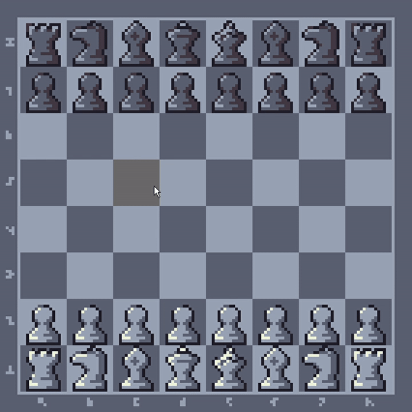

# 2D Chess Game

## Overview

This is a 2D chess game developed using SDL2 and C++. The game features a graphical representation of a chessboard and standard chess pieces. Players can move pieces according to the rules of chess, and the game provides visual feedback for piece selection and movement.



1. **Navigate to the project directory**:

   ```
   cd path/to/your/project
   ```
2. **Build the project**:

    **Using the make command, simply run:**
    ```
    make
    ```

    **Using the g++ command:**

    Alternatively, you can manually compile the project with
    ```
    g++ -Iinclude -Iinclude/SDL2 -Iinclude/headers -Isrc main.cpp src/Pieces.cpp src/TextureManager.cpp src/Board.cpp src/PieceManager.cpp src/Game.cpp -o main.exe -Llib -lmingw32 -lSDL2main -lSDL2 -lSDL2_image -lSDL2_ttf
    ```